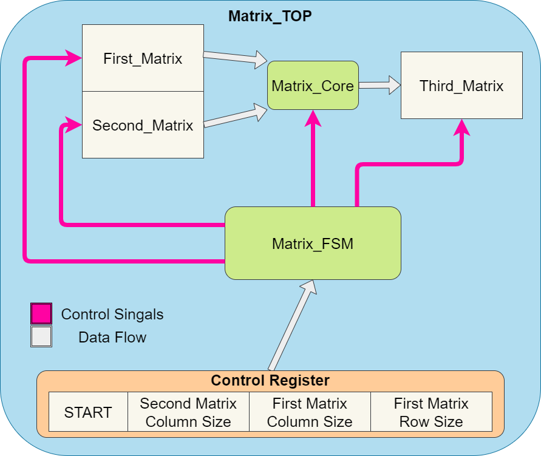

# YONGA-SERV Accelerator

[](https://opensource.org/licenses/Apache-2.0) [](https://github.com/efabless/caravel_project_example/actions/workflows/user_project_ci.yml) [](https://github.com/efabless/caravel_project_example/actions/workflows/caravel_build.yml)

Table of contents
=================

- [Overview](#overview)
- [Setup](#setup)
- [Running Simulation](#running-simulation)
- [Hardening the User Project Macro using OpenLANE](#hardening-the-user-project-macro-using-openlane)
- [Checklist for Open-MPW Three Submission](#checklist-for-open-mpw-three-submission)
- [List of Contributors](#list-of-contributors)

Overview
========

YONGA-SERV Accelerator includes the award-winning SERV RISC-V processor with a matrix multiplication accelerator.

## Memory Map of YONGA-SERV Accelerator

| Peripheral| Base Address| 
| --- | ---     |
| SRAM | 0x00000000|
| TIMER| 0x80000000|
| GPIO | 0x40000000|
| ACC  | 0xC0000000|

### GPIO

There are 38 memory mapped IO ports.

| Peripheral| Base Address| Size (bits)|
| ---| ---| ---|    
| GPIO_0| 0x40000000| 32 |    
| GPIO_1| 0x40000004| 6 |    

GPIO_1 is connected to the lower 6 bits of the data bus. The top 26 bits will be discarded on write operation.

### TIMER

Timer is a 32-bit register. Current time can be read but can not be written. Any write operation to this address will update time_cmp register.

| Peripheral| Base Address| Size (bits)|
| ---       | ---         | --- |
| TIMER | 0x80000000| 32 |

### ACCELERATOR

Matrices are memory mapped like 2D C arrays. The first matrix, _control register_ and the second matrix are write only. The third matrix, and register _finished_ are read only.

|           | Base Address| Size (bits)|
| ---       | ---         | ---        |
| Control Register  | 0xC0000000| 25    |
| First Matrix      | 0xC0000400| 32*64 |
| Second Matrix     | 0xC0000800| 32*64 |
| Third Matrix      | 0xC0000C00| 32*64 |
| Register Finished | 0xC0001000| 1     |

#### Field Encoding of Control Register

| Start| SMCS| FMCS| FMRS|
| ---  | --- | --- | --- |
| 1-bit | 8-bit | 8-bit | 8-bit |

#### OPERATION   

Accelerator has to know the dimensions of the matrices before the operation. These dimensions are specified in the respective fields of the control register.
When the start bit of the control register is set to HIGH, matrix multiplication starts and the register _finished_ is set to LOW by the accelerator. The third matrix is ready to be read as soon as the register _finished_ is set to HIGH by the accelerator. To restart the operation again the start bit must be set to LOW first and then set to HIGH.

A 1x1 matrix multiplication can be expressed in pseudo-code as follows:   

<pre>
* (*0xC0000400) = a          // set the first matrix
* (*0xC0000800) = b          // set the second matrix
* (*0xC0000000) = 0x01010101 // set start bit to 1, FMCS=SMCS=FMRS=1
* wait if (*0xC0001000) == 0 // wait until register finished is 1
* res = (*0xC0000C00)        // result is ready to use and its value equals a[] times b[]
</pre>

An example code with higher dimensional matrices can be found in the sw directory.

#### Top-Level Diagram


## ABBREVIATIONS
**ACC**: Accelerator   
**FM**: First Matrix   
**SM**: Second Matrix   
**TM**: Third Matrix   
**FMCS**: First Matrix Column Size   
**FMRS**: First Matrix Row Size   
**SMCS**: Second Matrix Column Size   
**FSM**: Finite State Machine   
***_RW**: Read Write   
**SW**: Software   
**ASM**: Assembly

Setup
========

```bash
export PDK_ROOT=<pdk-installation-path>
export OPENLANE_ROOT=<openlane-installation-path>
cd $UPRJ_ROOT
export CARAVEL_ROOT=$(pwd)/caravel
make install
```

Running Simulation
========

TBA

Hardening the User Project Macro using OpenLANE
========

TBA

Checklist for Open-MPW Three Submission
=================================

TBA

List of Contributors
=================================

*In alphabetical order:*

- Adem Golcuk
- Berk Kisinbay
- Burak Yakup Cakar
- Emre Hakan Demirli
- Muhammed Bahadir Turkoglu
